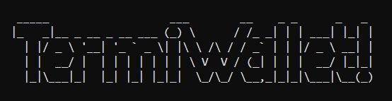
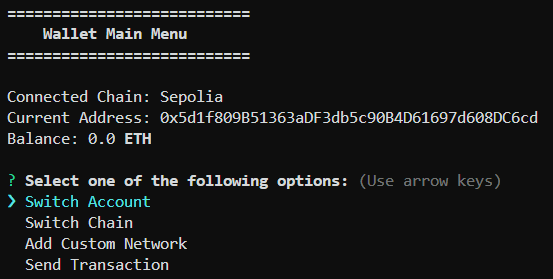

<!-- Improved compatibility of back to top link: See: https://github.com/othneildrew/Best-README-Template/pull/73 -->

<a name="readme-top"></a>

<!--
*** Thanks for checking out the Best-README-Template. If you have a suggestion
*** that would make this better, please fork the repo and create a pull request
*** or simply open an issue with the tag "enhancement".
*** Don't forget to give the project a star!
*** Thanks again! Now go create something AMAZING! :D
-->

<!-- PROJECT SHIELDS -->
<!--
*** I'm using markdown "reference style" links for readability.
*** Reference links are enclosed in brackets [ ] instead of parentheses ( ).
*** See the bottom of this document for the declaration of the reference variables
*** for contributors-url, forks-url, etc. This is an optional, concise syntax you may use.
*** https://www.markdownguide.org/basic-syntax/#reference-style-links
-->
<p align="center">


</p>

<!-- PROJECT LOGO -->
<br />
<div align="center">
  <a href="https://github.com/GreatApe77/ethereum-wallet-cli">
    
  </a>

  <h3 align="center">Termiwallet</h3>

  <p align="center">
    A simple terminal cripto wallet for managing your finances.
    <br />
   
    
  </p>
</div>

<!-- TABLE OF CONTENTS -->

<details>

<summary>Table of Contents</summary>
  <ol>
    <li>
      <a href="#about-the-project">About The Project</a>
    </li>
    <li>
      <a href="#built-with">Built With</a>
    </li>
    <li>
      <a href="#getting-started-npm-package">Getting Started (NPM Package)</a>
    </li>
    <li>
      <a href="#getting-started-source-code">Getting Started (Source Code)</a>
    </li>
    <li>
      <a href="#getting-started-docker">Getting Started (Docker)</a>
    </li>
    <li>
      <a href="#license">License</a>
    </li>
  </ol>
</details>

<!-- ABOUT THE PROJECT -->

## About The Project

This is a simple terminal wallet for managing your finances. Its functionality is inspired by the popular Browser extension MetaMask, which allows users to interact with the Ethereum blockchain. This project is a terminal wallet that allows users to manage their finances in a similar way.

<div>
    
</div>

### Built With

<!-- * [![JQuery][JQuery.com]][JQuery-url]-->

- [Node.js](https://nodejs.org/en/)
- [TypeScript](https://www.typescriptlang.org/)
- [Ethers.js](https://docs.ethers.io/v6/)
- [Inquirer.js](https://www.npmjs.com/package/inquirer)
- [Chalk](https://www.npmjs.com/package/chalk)
- [Figlet](https://www.npmjs.com/package/figlet)

<!-- GETTING STARTED -->

## Getting Started (NPM Package)

You can install the package globally and run it from the terminal

### Prerequisites

- [Node.js](https://nodejs.org/en/)
- [NPM](https://www.npmjs.com/)

### Installation

1.  Install the package globally

    ```sh
    npm install -g @great_ape77/ethereum-wallet-cli
    ```

2.  Run the wallet

    ```sh
    termiwallet
    ```

## Getting Started (Source Code)

To get started with this project, you can clone the repository and run the project locally

### Prerequisites

- [Node.js](https://nodejs.org/en/)
- [NPM](https://www.npmjs.com/)

### Installation

1.  Clone the repo

    ```sh
    git clone https://github.com/GreatApe77/ethereum-wallet-cli
    ```

2.  Change directory to the project folder

    ```sh
    cd ethereum-wallet-cli
    ```

3.  Install NPM packages

    ```sh
    npm install
    ```

4.  Run the project

    ```sh
    npm run dev
    ```

## Getting Started (Docker)

To run the project using Docker, you can use the following commands

### Prerequisites

You need to have Docker installed on your machine to run this project. You can download it from [here](https://www.docker.com/)

### Install and execute

You will run the docker image in interactive mode to interact with the wallet

1. Build the docker image

   ```sh
   docker run -it ghcr.io/greatape77/ethereum-wallet-cli:latest
   ```

## License

Distributed under the MIT License. See `LICENSE` for more information.

<!--

<p align="right">(<a href="#readme-top">back to top</a>)</p>
-->
